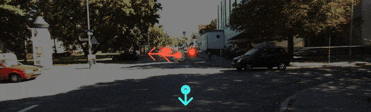
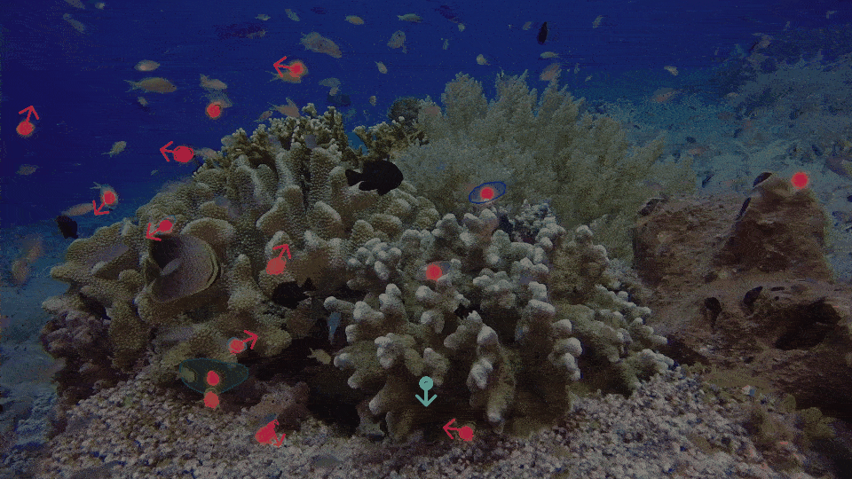

# rigidmask
Code for "Learning to Segment Rigid Motions from Two Frames".

** This is a partial release with inference and evaluation code. The project is still being tested and documented. There might be implemention changes in the future release. Thanks for your interest.

Visuals on Sintel/KITTI/Coral (not temporally smoothed):
<p align="center">  </p>
<p align="center">  </p>
<p align="center">  </p>

If you find this work useful, please consider citing:
```
@inproceedings{yang2021rigidmask,
title={Learning to Segment Rigid Motions from Two Frames},
author={Yang, Gengshan and Ramanan, Deva},
booktitle={CVPR},
year={2021}
}
```

## Data and precomputed results
Download 
* [KITTI-SF](http://www.cvlibs.net/download.php?file=data_scene_flow.zip), 
* [Sintel-RVC](https://github.com/ozendelait/rvc_devkit/tree/release/flow), 
* [Sintel rigidity map](http://files.is.tue.mpg.de/jwulff/mrflow/sintel_rigiditymaps.zip).

Additional inputs (coral reef images) and precomputed results are hosted on google drive. Run (assuming you have installed [gdown](https://github.com/wkentaro/gdown))
```
gdown https://drive.google.com/uc?id=1Up2cPCjzd_HGafw1AB2ijGmiKqaX5KTi -O ./input.tar.gz
gdown https://drive.google.com/uc?id=12C7rl5xS66NpmvtTfikr_2HWL5SakLVY -O ./rigidmask-sf-precomputed.zip
tar -xzvf ./input.tar.gz 
unzip ./rigidmask-sf-precomputed.zip -d precomputed/
```
To compute the results in Tab.1, Tab.2 on KITTI,
```
modelname=rigidmask-sf
python eval/eval_seg.py  --path precomputed/$modelname/  --dataset 2015
python eval/eval_sf.py   --path precomputed/$modelname/  --dataset 2015

```

## Install
The code is tested with python 3.8, pytorch 1.7.0, and CUDA 10.2. Install dependencies by
```
conda env create -f rigidmask.yml
conda activate rigidmask_v0
conda install -c conda-forge kornia=0.5.3 # install a compatible korna version
python -m pip install detectron2 -f \
  https://dl.fbaipublicfiles.com/detectron2/wheels/cu102/torch1.7/index.html
```
Compile [DCNv2](https://github.com/MatthewHowe/DCNv2) and [ngransac](https://github.com/vislearn/ngransac).
```
cd models/networks/DCNv2/; python setup.py install; cd -
cd models/ngransac/; python setup.py install; cd -
```

## Pretrained models
Download pre-trained models to `./weights` (assuming gdown is installed),
```
mkdir weights
mkdir weights/rigidmask-sf
mkdir weights/rigidmask-kitti
gdown https://drive.google.com/uc?id=1H2khr5nI4BrcrYMBZVxXjRBQYBcgSOkh -O ./weights/rigidmask-sf/weights.pth
gdown https://drive.google.com/uc?id=1sbu6zVeiiK1Ra1vp_ioyy1GCv_Om_WqY -O ./weights/rigidmask-kitti/weights.pth
```

|modelname | training set | flow model | flow err. (K:Fl-err/EPE)  | motion-in-depth err. (K:1e4) | seg. acc. (K:obj/K:bg/S:bg) |
|---|---:|---:|---:|---:|---:|
|[rigidmask-sf (mono)](https://drive.google.com/uc?id=1KMEqXlisLgK4n9alWRbgIWch7TTye56u)          | SF         | C+SF+V        | 10.9%/3.128px    | 120.4 | 90.71%/97.05%/86.72% |
|[rigidmask-kitti (stereo)](https://drive.google.com/uc?id=11Cf3NxbzGq2rdwdI2_HuQDlwIWNWMu7u)     | SF+KITTI   | C+SF+V->KITTI | 4.1%/1.155px | 49.7  | 95.58%/98.91%/-  |

** C: FlythingChairs, SF(SceneFlow including FlyingThings, Monkaa, and Driving, K: KITTI scene flow training set, V: VIPER, S: Sintel. Averaged over the 200 annotated KITTI pairs.

## Inference
Run and visualize rigid segmentation of coral reef video, (pass --refine to turn on rigid motion refinement). Results will be saved at `./weights/$modelname/seq/` and a output-seg.gif file will be generated in the current folder.
```
modelname=rigidmask-sf
CUDA_VISIBLE_DEVICES=1 python submission.py --dataset seq-coral --datapath input/imgs/coral/   --outdir ./weights/$modelname/ --loadmodel ./weights/$modelname/weights.pth --testres 1
python eval/generate_visual.py --datapath weights/$modelname/seq-coral/ --imgpath input/imgs/coral
```

Run and visualize two-view depth estimation on kitti video, a output-depth.gif will be saved to the current folder.
```
modelname=rigidmask-sf
CUDA_VISIBLE_DEVICES=1 python submission.py --dataset seq-kitti --datapath input/imgs/kitti_2011_09_30_drive_0028_sync_11xx/   --outdir ./weights/$modelname/ --loadmodel ./weights/$modelname/weights.pth --testres 1.2 --refine
python eval/generate_visual.py --datapath weights/$modelname/seq-kitti/ --imgpath input/imgs/kitti_2011_09_30_drive_0028_sync_11xx
python eval/render_scene.py --inpath weights/rigidmask-sf/seq-kitti/pc0-0000001110.ply
```

Run and evaluate kitti-sceneflow (monocular setup, Tab. 1 and Tab. 2),
```
modelname=rigidmask-sf
CUDA_VISIBLE_DEVICES=1 python submission.py --dataset 2015 --datapath path-to-kitti-sceneflow-training   --outdir ./weights/$modelname/ --loadmodel ./weights/$modelname/weights.pth  --testres 1.2 --refine
python eval/eval_seg.py   --path weights/$modelname/  --dataset 2015
python eval/eval_sf.py   --path weights/$modelname/  --dataset 2015
```
```
modelname=rigidmask-sf
CUDA_VISIBLE_DEVICES=1 python submission.py --dataset sintel_mrflow_val --datapath path-to-sintel-training   --outdir ./weights/$modelname/ --loadmodel ./weights/$modelname/weights.pth  --testres 1.5 --refine
python eval/eval_seg.py   --path weights/$modelname/  --dataset sintel
python eval/eval_sf.py   --path weights/$modelname/  --dataset sintel
```

Run and evaluate kitti-sceneflow (stereo setup, Tab. 6),
```
modelname=rigidmask-kitti
CUDA_VISIBLE_DEVICES=1 python submission.py --dataset 2015 --datapath path-to-kitti-sceneflow-images   --outdir ./weights/$modelname/ --loadmodel ./weights/$modelname/weights.pth  --disp_path input/disp/kittisf-train-hsm-disp/ --fac 2 --maxdisp 512 --refine --sensor stereo
python eval/eval_seg.py   --path weights/$modelname/  --dataset 2015
python eval/eval_sf.py    --path weights/$modelname/  --dataset 2015
```

To generate results for kitti-sceneflow benchmark (stereo setup, Tab. 3),
```
modelname=rigidmask-kitti
mkdir ./benchmark_output
CUDA_VISIBLE_DEVICES=1 python submission.py --dataset 2015test --datapath path-to-kitti-sceneflow-images  --outdir ./weights/$modelname/ --loadmodel ./weights/$modelname/weights.pth  --disp_path input/disp/kittisf-test-ganet-disp/ --fac 2 --maxdisp 512 --refine --sensor stereo
```

## Training (TODO)
### Training on synthetic dataset
First download and unzip the [scene flow dataset](https://lmb.informatik.uni-freiburg.de/resources/datasets/SceneFlowDatasets.en.html) under the same folder. You'll need RGB images, camera data, object segmentation, disparity, disparity change, and optical flow. It takes 1~2 TB space.
Then download the pre-trained optical flow and expansion network (trained on synthetic datasets)
```
gdown https://drive.google.com/uc?id=11F_dI6o37nzA9B5V7OT-UwAl66LWlu-4 -O ./weights/flowexp-sf.pth
```
To train the rigidmask-sf model, run
```
datapath=path-to-data-dir
CUDA_VISIBLE_DEVICES=0,1,2,3 python -m torch.distributed.launch --nproc_per_node=4 train.py --logname logname --database $datapath --savemodel ./weights --stage segsf --nproc 4 --loadmodel ./weights/flowexp-sf.pth
```

### Training on synthetic dataset + KITTI
First download and place the KITTI-SF dataset under the same folder as the scene flow dataset.
The pre-computed relative camera poses of KITTI-SF can be downloaded [here](https://drive.google.com/file/d/1SzCVKM7Sv1QMGto9EpDBXhkXAnBrd1yV/view?usp=sharing), and placed under`kitti_scene/training/`.

Then download the pre-trained optical flow and expansion network (trained on synthetic datasets and fine-tuned on KITTI).
```
gdown https://drive.google.com/uc?id=1uWPvL71KXeFY0U4wFluJfYJdcFfwEH_G -O ./weights/flowexp-kitti.pth
      
```
To train the rigidmask-kitti model, run
```
datapath=path-to-data-dir
CUDA_VISIBLE_DEVICES=0,1,2,3 python -m torch.distributed.launch --nproc_per_node=4 train.py --logname logname --database $datapath --savemodel ./weights --stage segkitti --nproc 4 --loadmodel ./weights/flowexp-kitti.pth
```

## Acknowledge (incomplete)
* Source of coral reef video: [Beautiful Dive in Philippines Tubbataha Atoll Coral Reef Natural Park & Whale Shark in Sulu Sea HD.](https://www.youtube.com/watch?v=799y7KxZ3Iw)
* [DCNv2](https://github.com/MatthewHowe/DCNv2) 
* [ngransac](https://github.com/vislearn/ngransac).
* [CenterNet](https://github.com/xingyizhou/CenterNet)
* [PolarMask](https://github.com/xieenze/PolarMask)
